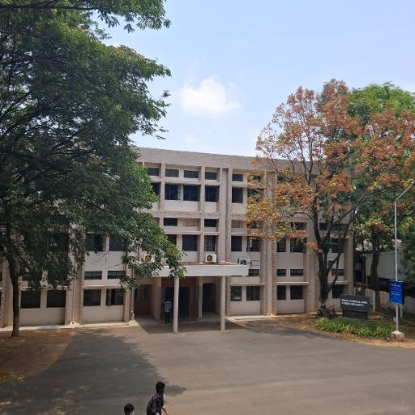

# Visual-Prompt-based-Editing 🎨🖋️

An interactive AI tool for editing images using natural language instructions. Built using [InstructPix2Pix](https://huggingface.co/timbrooks/instruct-pix2pix) by Tim Brooks and a Gradio-based interface.

<p align="center">
  
  
</p>

---

## 🚀 Features

- Edit any image with simple **textual prompts**
- Upload or capture image using webcam
- Resize images to **512x512** (matching model input size)
- Works on systems with **8GB VRAM (RTX 4060)** using model offloading
- 1-click example prompts for quick testing

---

## 📦 Installation

Clone the repo:

```bash
git clone https://github.com/CJ445/Visual-Prompt-based-Editing
cd Visual-Prompt-based-Editing
```

Create and activate a virtual environment:

```bash
python -m venv venv
source venv/bin/activate
```

Install dependencies:

```bash
pip install -r requirement.txt
```

---

## 🧠 Model

Uses the **Stable Diffusion InstructPix2Pix** pipeline, which includes:

- VAE (Variational Autoencoder)
- U-Net (core image transformer)
- Text Encoder (understands prompts)
- Scheduler (controls image evolution over steps)

---

## ▶️ Run the App

```bash
python instruct_pix2pix_gradio.py
```

Visit `http://127.0.0.1:7860` to try it out.

---

## 📷 Examples

| Input Image           | Prompt                 | Output |
|-----------------------|------------------------|--------|
| `examples/basil.jpg`  | "Make him wear a suit" | ✅     |
| `examples/DSCS.jpg`   | "Make it rain"         | ✅     |

---

## 🧪 Dependencies

Tested with:

- Python 3.12
- PyTorch 2.6
- Diffusers 0.33.0.dev0
- Gradio 5.23.3
- CUDA 12.4 (for NVIDIA GPU acceleration)

See [`requirement.txt`](requirement.txt) for full list.

---

Tested on the system with the following specs ( RTX 4060 with VRAM 8GB)

```
+-----------------------------------------------------------------------------------------+
| NVIDIA-SMI 570.124.04             Driver Version: 570.124.04     CUDA Version: 12.8     |
|-----------------------------------------+------------------------+----------------------+
| GPU  Name                 Persistence-M | Bus-Id          Disp.A | Volatile Uncorr. ECC |
| Fan  Temp   Perf          Pwr:Usage/Cap |           Memory-Usage | GPU-Util  Compute M. |
|                                         |                        |               MIG M. |
|=========================================+========================+======================|
|   0  NVIDIA GeForce RTX 4060 ...    On  |   00000000:01:00.0 Off |                  N/A |
| N/A   43C    P3             11W /   42W |      15MiB /   8188MiB |      0%      Default |
|                                         |                        |                  N/A |
+-----------------------------------------+------------------------+----------------------+
                                                                                         
+-----------------------------------------------------------------------------------------+
| Processes:                                                                              |
|  GPU   GI   CI              PID   Type   Process name                        GPU Memory |
|        ID   ID                                                               Usage      |
|=========================================================================================|
|    0   N/A  N/A            2337      G   /usr/lib/xorg/Xorg                        4MiB |
+-----------------------------------------------------------------------------------------+
```
## 🤖 Acknowledgements

- [InstructPix2Pix Paper](https://arxiv.org/abs/2211.09800)
- [Hugging Face Diffusers](https://huggingface.co/docs/diffusers)
- [Gradio](https://www.gradio.app)

---
